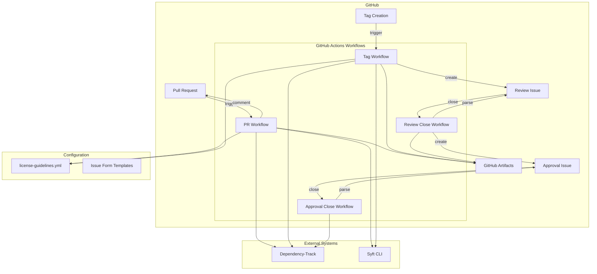

# 設計書: OSS管理システム

## 概要

OSS管理システムは、GitHub ActionsとDependency-Trackを中心としたワークフロー自動化システムです。SBOMの自動生成、差分検出、ライセンスガイドの提示、見直し・承認プロセスの管理を通じて、OSSコンプライアンス管理を効率化します。

システムは以下の主要な処理フローで構成されます:

1. **PR作成時**: SBOM生成 → 差分比較 → PRコメント投稿
2. **タグ作成時**: SBOM生成 → 差分比較 → 見直しIssue作成
3. **見直しIssueクローズ時**: 対応結果抽出 → 承認Issue作成
4. **承認Issueクローズ時**: DT登録 → コンポーネントプロパティ設定

## アーキテクチャ

### システム構成図



### レイヤー構成

システムは以下の3つのレイヤーで構成されます:

1. **トリガーレイヤー**: GitHub イベント(PR作成、タグ作成、Issueクローズ)
2. **処理レイヤー**: GitHub Actions ワークフロー、スクリプト
3. **データレイヤー**: Dependency-Track、GitHub Artifacts、設定ファイル

## コンポーネントとインターフェース

### 1. SBOM Generator (Syft)

**責務**: ソースコードからSBOMを生成する

**インターフェース**:
```bash
# 入力
syft <source> -o cyclonedx-json=<output-path>

# 出力
# CycloneDX JSON形式のSBOMファイル
{
  "bomFormat": "CycloneDX",
  "specVersion": "1.4",
  "components": [
    {
      "group": "org.apache.logging.log4j",
      "name": "log4j-core",
      "version": "2.14.1",
      "licenses": [...]
    }
  ]
}
```

**実装詳細**:
- Syft CLIを使用
- CycloneDX 1.4以降のJSON形式で出力
- GitHub Actionsのステップとして実行

### 2. Diff Checker

**責務**: 2つのSBOM間のコンポーネント差分を検出する

**インターフェース**:
```typescript
interface DiffChecker {
  compare(currentSbom: SBOM, previousSbom: SBOM): ComponentDiff[];
}

interface ComponentDiff {
  changeType: 'added' | 'updated' | 'removed';
  component: Component;
  previousVersion?: string; // updatedの場合のみ
}

interface Component {
  group: string;
  name: string;
  version: string;
  licenses: License[];
}
```

**実装詳細**:
- TypeScript/JavaScriptで実装
- 比較キー: `${group}:${name}:${version}`
- 差分タイプの判定ロジック:
  - `added`: 新SBOMに存在し、旧SBOMに存在しない
  - `updated`: 両方に存在するが、versionが異なる
  - `removed`: 旧SBOMに存在し、新SBOMに存在しない

**アルゴリズム**:
```
1. 旧SBOMのコンポーネントをMapに格納 (キー: group:name)
2. 新SBOMの各コンポーネントについて:
   a. Mapに存在しない → added
   b. Mapに存在し、versionが異なる → updated
   c. Mapに存在し、versionが同じ → 差分なし
3. Mapに残ったコンポーネント → removed
```

### 3. License Guide Provider

**責務**: ライセンスごとのガイドライン情報を提供する

**インターフェース**:
```typescript
interface LicenseGuideProvider {
  getGuidelines(licenseId: string, context: ComponentContext): Guideline[];
}

interface ComponentContext {
  isModified?: boolean;
  linkType?: 'static' | 'dynamic';
  isDistributed?: boolean;
}

interface Guideline {
  condition: string;
  message: string;
  inputType: 'checkbox' | 'text' | 'select';
  label: string;
  options?: string[]; // selectの場合のみ
}
```

**設定ファイル形式** (license-guidelines.yml):
```yaml
version: "1.0"
guidelines:
  - license_id: "Apache-2.0"
    common_instructions: "Apache License 2.0の規定に従い、著作権表示と許諾表示を保持してください。"
    rules:
      - condition: "always"
        message: "NOTICEファイルが含まれている場合は製品に同梱してください。"
        input_type: "checkbox"
        label: "NOTICEファイルの対応"
      - condition: "is_modified == true"
        message: "改変を加えたファイルに、変更した旨の告知を記載してください。"
        input_type: "text"
        label: "改変内容のサマリ"
```

**実装詳細**:
- YAMLファイルをパースして読み込み
- 条件評価エンジン: 簡易的な式評価(always、is_modified、link_type、is_distributedのみサポート)
- デフォルトガイドライン: ライセンスが見つからない場合は汎用メッセージを返す

### 4. DT Client

**責務**: Dependency-Track APIとの通信を担当

**インターフェース**:
```typescript
interface DTClient {
  // SBOM取得
  getSBOM(projectName: string, version: string): Promise<SBOM | null>;
  
  // プロジェクト登録
  uploadSBOM(projectName: string, version: string, sbom: SBOM): Promise<string>; // returns project UUID
  
  // コンポーネントプロパティ設定
  setComponentProperty(
    projectUuid: string,
    component: Component,
    propertyName: string,
    propertyValue: string
  ): Promise<void>;
}
```

**API エンドポイント**:
- `GET /api/v1/bom/cyclonedx/project/{uuid}` - SBOM取得
- `PUT /api/v1/bom` - SBOM登録
- `GET /api/v1/component/project/{uuid}` - コンポーネント一覧取得
- `PUT /api/v1/component/{uuid}/property` - プロパティ設定

**実装詳細**:
- 認証: API Key (環境変数 `DT_API_KEY`)
- エラーハンドリング: HTTPステータスコードに基づく
- リトライロジック: 5xx エラーの場合、最大3回リトライ

### 5. Issue Creator

**責務**: GitHub Issueを作成する

**インターフェース**:
```typescript
interface IssueCreator {
  createReviewIssue(
    diffs: ComponentDiff[],
    guidelines: Map<string, Guideline[]>,
    sbomArtifactUrl: string
  ): Promise<number>; // returns issue number
  
  createApprovalIssue(
    reviewResults: ReviewResult[],
    sbomArtifactUrl: string,
    reviewResultsArtifactUrl: string
  ): Promise<number>;
}

interface ReviewResult {
  component: Component;
  actions: Map<string, string>; // label -> value
}
```

**実装詳細**:
- GitHub REST API (`@actions/github`)を使用
- Issue Form テンプレート(YAML)を動的に生成
- Markdown形式でテーブルとチェックボックスを生成

### 6. PR Commenter

**責務**: PRにコメントを投稿する

**インターフェース**:
```typescript
interface PRCommenter {
  postDiffComment(
    prNumber: number,
    diffs: ComponentDiff[],
    guidelines: Map<string, Guideline[]>,
    sbomArtifactUrl: string
  ): Promise<void>;
}
```

**コメントフォーマット**:
```markdown
## 🔍 OSS差分検出

前回リリースとの差分が検出されました。

### 差分一覧

| 変更 | OSS名 | バージョン | ライセンス |
|------|-------|-----------|-----------|
| 🆕 | lib-scanner | 2.1.0 | Apache-2.0 |
| 🔄 | fast-json | 1.4.0 → 1.5.0 | MIT |

### ライセンスガイドライン

**Apache-2.0 (lib-scanner)**
- NOTICEファイルが含まれている場合は製品に同梱してください。

**MIT (fast-json)**
- 著作権表示とライセンステキストを保持してください。

📦 [SBOM をダウンロード](<artifact-url>)
```

## データモデル

### SBOM (CycloneDX)

```typescript
interface SBOM {
  bomFormat: "CycloneDX";
  specVersion: string;
  serialNumber?: string;
  version?: number;
  metadata?: Metadata;
  components: Component[];
}

interface Component {
  type: "library" | "application" | "framework" | "container" | "file";
  group?: string;
  name: string;
  version: string;
  licenses?: License[];
  purl?: string; // Package URL
  hashes?: Hash[];
}

interface License {
  license?: {
    id?: string; // SPDX ID
    name?: string;
    url?: string;
  };
  expression?: string; // SPDX expression
}
```

### 差分結果

```typescript
interface DiffResult {
  comparisonInfo: {
    currentVersion: string;
    previousVersion: string;
    comparedAt: string; // ISO 8601
  };
  diffs: ComponentDiff[];
}
```

### 見直し結果 (JSON)

```typescript
interface ReviewResultsDocument {
  version: string; // リリースバージョン
  reviewedAt: string; // ISO 8601
  reviewer: string; // GitHub username
  results: ComponentReviewResult[];
}

interface ComponentReviewResult {
  component: {
    group?: string;
    name: string;
    version: string;
  };
  license: string;
  actions: Record<string, string>; // label -> value
}
```

### GitHub Issue Form (YAML)

見直しIssueのテンプレート例:

```yaml
name: OSS利用見直しタスク
description: リリース前のOSS利用見直し
title: "[Review] OSS利用見直し v{version}"
labels: ["oss-review"]
body:
  - type: markdown
    attributes:
      value: |
        ## 🔍 差分一覧とガイドライン
        
        | OSS名 | バージョン | ライセンス | 変更 |
        |-------|-----------|-----------|------|
        | lib-scanner | 2.1.0 | Apache-2.0 | 新規 |
  
  - type: checkboxes
    id: common-checks
    attributes:
      label: 共通チェック事項
      options:
        - label: すべての新規OSSについて、ライセンス種別に誤りがないことを確認した
          required: true
        - label: 意図しないバージョンアップが含まれていないことを確認した
          required: true
  
  - type: input
    id: lib-scanner-notice
    attributes:
      label: "lib-scanner: NOTICEファイルの対応"
      description: "NOTICEファイルが含まれている場合は製品に同梱してください"
      placeholder: "対応済み / 対応不要"
    validations:
      required: true
  
  - type: checkboxes
    id: approval-request
    attributes:
      label: 承認依頼
      options:
        - label: 管理者に承認を依頼する
```


## Correctness Properties

プロパティとは、システムのすべての有効な実行において真であるべき特性や動作のことです。プロパティは、人間が読める仕様と機械で検証可能な正確性保証の橋渡しとなります。

### Property 1: SBOM形式の妥当性

*任意の*ソースコードに対して、SBOM_Generatorが生成するSBOMは、CycloneDX仕様に準拠した有効なJSON形式であり、すべてのコンポーネントがname、versionフィールドを持つこと

**Validates: 要件 1.3, 1.5**

### Property 2: SBOM差分検出の正確性

*任意の*2つのSBOM(旧、新)に対して、Diff_Checkerが出力する差分リストは以下を満たすこと:
- 新SBOMにのみ存在するコンポーネントは「added」として識別される
- 両SBOMに存在し、versionが異なるコンポーネントは「updated」として識別される
- 旧SBOMにのみ存在するコンポーネントは「removed」として識別される
- 差分リストに含まれるすべてのコンポーネントは、実際に差分がある

**Validates: 要件 2.2, 2.3, 2.4**

### Property 3: YAMLガイドライン設定のラウンドトリップ

*任意の*有効なlicense-guidelines.yml設定に対して、License_Guide_Providerが読み込み、内部表現に変換した後、同じ構造を再構築できること

**Validates: 要件 3.1**

### Property 4: ライセンスガイドライン取得の完全性

*任意の*ライセンスIDとコンポーネントコンテキストに対して、License_Guide_Providerが返すガイドラインは以下を満たすこと:
- 設定ファイルに定義されたライセンスの場合、対応するすべてのルールが含まれる
- 各ルールの条件がコンテキストに対して正しく評価される
- 各ガイドラインが適切な入力タイプ(checkbox、text、select)を持つ

**Validates: 要件 3.2, 3.3, 3.4**

### Property 5: PRコメント生成の完全性

*任意の*差分リストとガイドラインマップに対して、PR_Commenterが生成するコメントは以下を満たすこと:
- すべての差分コンポーネントがテーブルに含まれる
- 各コンポーネントに対応するライセンスガイドラインが含まれる
- SBOMアーティファクトへのリンクが含まれる
- Markdown形式として有効である

**Validates: 要件 4.2, 4.3, 4.4, 4.5**

### Property 6: 見直しIssue生成の完全性

*任意の*差分リストとガイドラインマップに対して、Issue_Creatorが生成する見直しIssue Formは以下を満たすこと:
- 有効なGitHub Issue Form YAML形式である
- すべての差分コンポーネントがテーブルに含まれる
- 各コンポーネントに対応する入力フィールドが、ガイドラインの仕様(input_type、label)に従って生成される
- 承認要求チェックボックスが含まれる
- SBOMアーティファクトへのリンクが含まれる

**Validates: 要件 5.2, 5.3, 5.4, 5.5, 5.6**

### Property 7: 承認Issue生成の完全性

*任意の*見直し結果リストに対して、Issue_Creatorが生成する承認Issueは以下を満たすこと:
- すべての見直し結果が含まれる
- SBOMアーティファクトへのリンクが含まれる
- 見直し結果JSONアーティファクトへのリンクが含まれる
- Markdown形式として有効である

**Validates: 要件 6.3, 6.4**

### Property 8: コンポーネント識別の一貫性

*任意の*SBOMとDTコンポーネントリストに対して、DT_Clientのコンポーネントマッチングロジックは以下を満たすこと:
- group、name、versionが完全一致するコンポーネントのみがマッチする
- マッチしたコンポーネントは一意である(重複マッチがない)

**Validates: 要件 7.4**

### Property 9: Issue本文パースの正確性

*任意の*見直しIssue本文(GitHub Issue Formの出力形式)に対して、パーサーが抽出する見直し結果は以下を満たすこと:
- すべての入力フィールドの値が正しく抽出される
- コンポーネント識別子(group、name、version)が正しく抽出される
- 承認要求チェックボックスの状態が正しく抽出される

**Validates: 要件 8.1**

### Property 10: 見直し結果のシリアライゼーション

*任意の*見直し結果オブジェクトに対して、JSON形式にシリアライズし、デシリアライズした結果は元のオブジェクトと等価であること(ラウンドトリップ)。また、JSONは以下を含むこと:
- コンポーネント識別子(group、name、version)
- 対応する見直しアクション

**Validates: 要件 8.2, 8.4**

## エラーハンドリング

### SBOM生成エラー

- Syftの実行が失敗した場合、GitHub Actionsワークフローは即座に失敗し、エラーログを出力します
- エラーログには、Syftの終了コードと標準エラー出力が含まれます

### DT API エラー

- DT APIコールが失敗した場合(HTTPステータス 4xx、5xx)、DT_Clientはエラーをログに記録し、例外をスローします
- 5xxエラーの場合、最大3回まで指数バックオフでリトライします
- エラーログには、HTTPステータスコード、レスポンスボディ、リクエストパラメータが含まれます

### ライセンスガイドライン設定エラー

- license-guidelines.ymlが存在しない、または無効なYAML形式の場合、License_Guide_Providerは警告をログに記録し、デフォルトガイドラインを使用します
- デフォルトガイドライン: "このライセンスのガイドラインが定義されていません。法務担当に相談してください。"

### Issue作成エラー

- GitHub API経由のIssue作成が失敗した場合、Issue_Creatorはエラーをログに記録し、ワークフローを失敗させます
- エラーログには、APIレスポンス、リクエストボディが含まれます

### 比較対象SBOM不在

- DTに比較対象のSBOMが存在しない場合(初回リリース時など)、Diff_Checkerは警告をログに記録し、すべてのコンポーネントを「added」として扱います
- この動作により、初回リリース時でもワークフローが正常に完了します

## テスト戦略

### デュアルテストアプローチ

システムの正確性を保証するため、ユニットテストとプロパティベーステストの両方を使用します:

- **ユニットテスト**: 特定の例、エッジケース、エラー条件を検証
- **プロパティベーステスト**: すべての入力に対する普遍的なプロパティを検証

両者は補完的であり、包括的なカバレッジに必要です。

### ユニットテストの焦点

ユニットテストは以下に焦点を当てます:

- **特定の例**: 正しい動作を示す具体的なケース
  - 例: Apache-2.0ライセンスの差分に対するPRコメント生成
  - 例: 空のSBOMに対する差分検出
- **エッジケース**:
  - 空のコンポーネントリスト
  - groupフィールドが欠落したコンポーネント
  - デュアルライセンス
- **エラー条件**:
  - 無効なYAML設定
  - 不正なJSON形式
  - DT API接続エラー

### プロパティベーステストの設定

プロパティベーステストには、JavaScriptエコシステムの**fast-check**ライブラリを使用します。

**設定**:
- 各プロパティテストは最低100回の反復を実行
- 各テストは設計書のプロパティを参照するタグを含む
- タグ形式: `Feature: oss-management-system, Property {番号}: {プロパティテキスト}`

**テスト対象プロパティ**:

1. **Property 1**: SBOM形式の妥当性
   - ジェネレーター: ランダムなコンポーネントリスト
   - 検証: CycloneDX JSONスキーマ準拠、必須フィールド存在

2. **Property 2**: SBOM差分検出の正確性
   - ジェネレーター: ランダムなSBOMペア(旧、新)
   - 検証: 差分タイプの正確性、差分リストの完全性

3. **Property 3**: YAMLガイドライン設定のラウンドトリップ
   - ジェネレーター: ランダムなライセンスガイドライン設定
   - 検証: 読み込み → 内部表現 → 再構築 = 元の設定

4. **Property 4**: ライセンスガイドライン取得の完全性
   - ジェネレーター: ランダムなライセンスIDとコンテキスト
   - 検証: ガイドライン内容の正確性、条件評価の正確性

5. **Property 5**: PRコメント生成の完全性
   - ジェネレーター: ランダムな差分リストとガイドライン
   - 検証: コメント内容の完全性、Markdown形式の妥当性

6. **Property 6**: 見直しIssue生成の完全性
   - ジェネレーター: ランダムな差分リストとガイドライン
   - 検証: YAML形式の妥当性、内容の完全性

7. **Property 7**: 承認Issue生成の完全性
   - ジェネレーター: ランダムな見直し結果リスト
   - 検証: 内容の完全性、Markdown形式の妥当性

8. **Property 8**: コンポーネント識別の一貫性
   - ジェネレーター: ランダムなSBOMとDTコンポーネントリスト
   - 検証: マッチングロジックの正確性、一意性

9. **Property 9**: Issue本文パースの正確性
   - ジェネレーター: ランダムな見直しIssue本文
   - 検証: パース結果の正確性

10. **Property 10**: 見直し結果のシリアライゼーション
    - ジェネレーター: ランダムな見直し結果オブジェクト
    - 検証: ラウンドトリップ(serialize → deserialize = 元のオブジェクト)

### 統合テスト

以下は統合テストの範囲であり、プロパティベーステストやユニットテストではカバーしません:

- GitHub Actionsワークフローのトリガー
- GitHub API経由のIssue作成
- Dependency-Track API経由のSBOM登録
- GitHub Artifactsへのファイルアップロード

これらは、実際のGitHubリポジトリとDTインスタンスを使用したE2Eテストで検証します。
